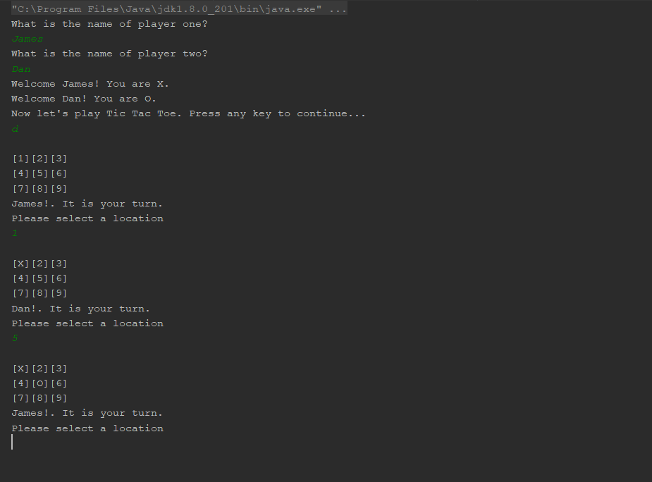

# Hangman

## Intro

This is a basic Java Console Application ported from C# for a Tic Tac Toe game for 2 players. Demonstrates object interactions in an OOP language. 

## Requirements

Java IDE (Intellij was used in development)

## Instructions

Clone this repo to local storage and open it up using a Java IDE.

Compile and run the application.

A console command should appear to prompt you for inputs. 

Select options as they appear.

## Additional Notes

Outside the game, user will have to specify the option and confirm it via the enter key.

## Result

